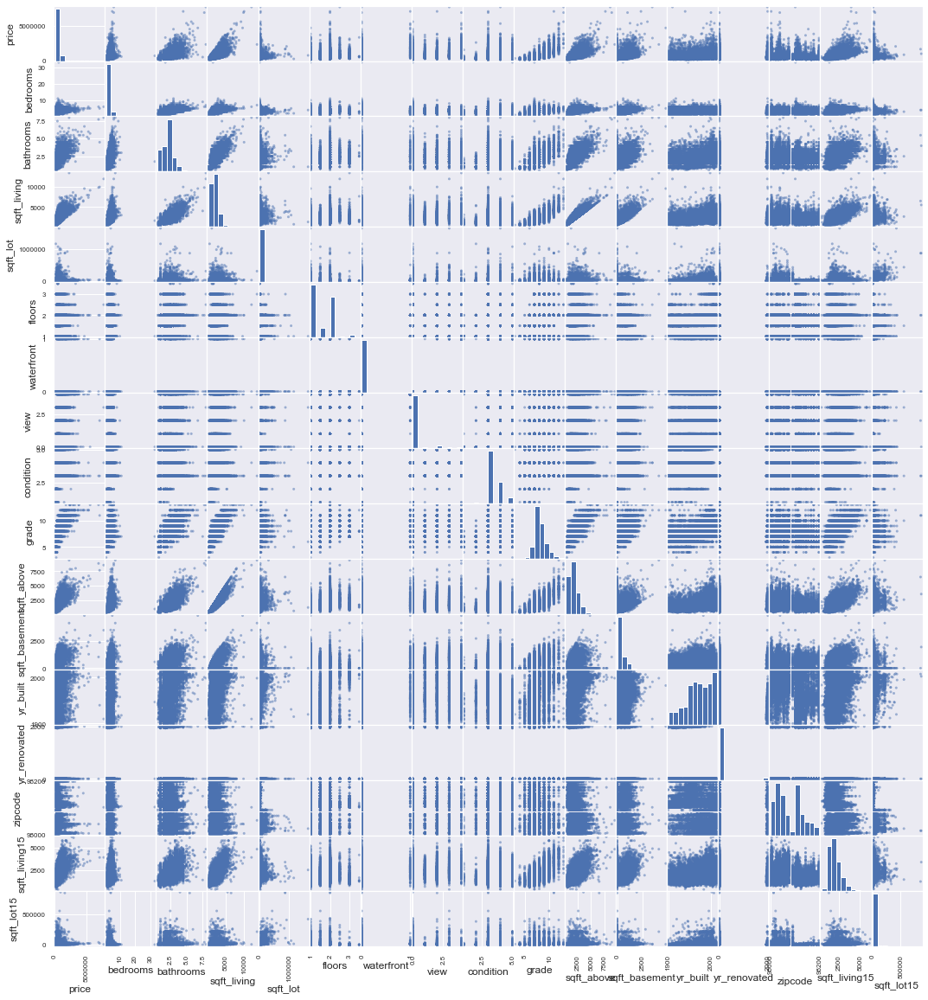
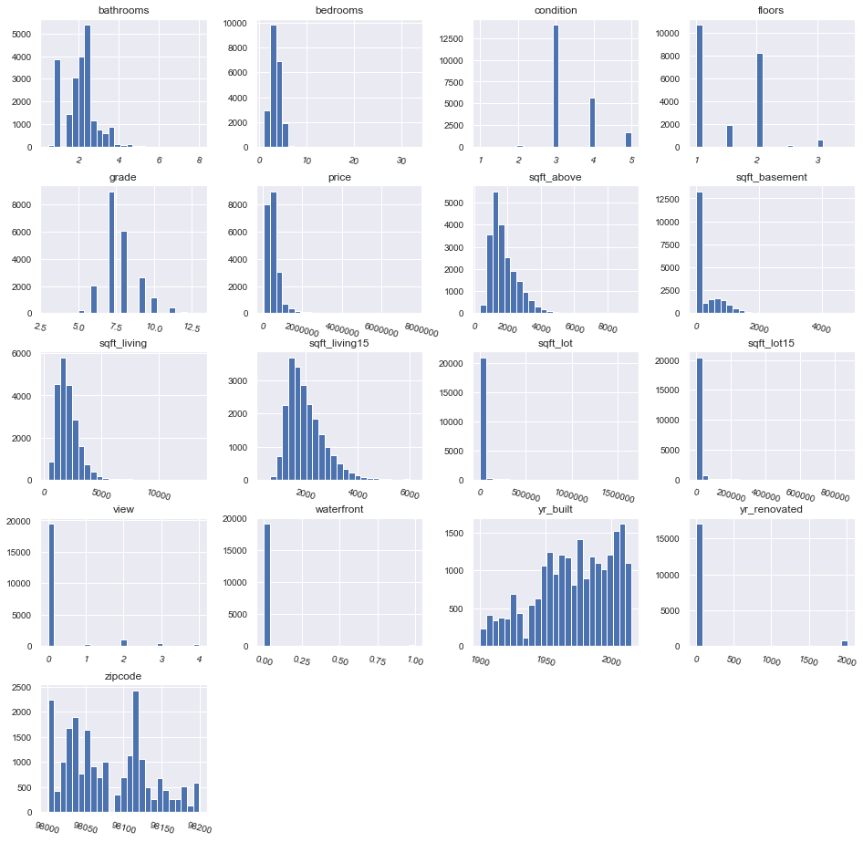
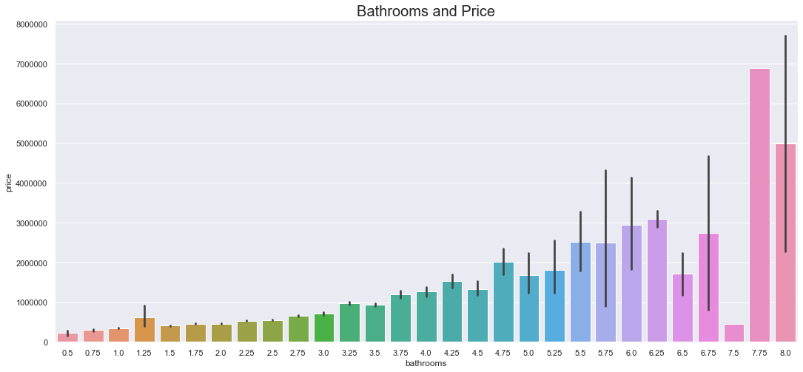
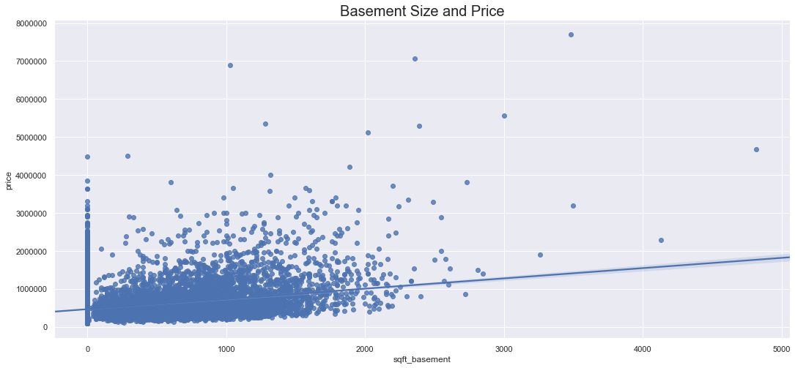

# Final Project Submission


* Student name: **Andrew Hotchkiss**
* Student pace: **Part time**
* Scheduled project review date/time: **8/17/2020, 2pm EDT**
* Instructor name: **James Irving**
* Blog post URL: https://stones-1130.github.io/interpreting_modeling_results_after_log_transformation


## TABLE OF CONTENTS 

*Click to jump to matching Markdown Header.*<br><br>

<font size=3rem>
    
- **[Introduction](#INTRODUCTION)<br>**
- **[OBTAIN](#OBTAIN)**<br>
- **[SCRUB](#SCRUB)**<br>
- **[EXPLORE](#EXPLORE)**<br>
- **[MODEL](#MODEL)**<br>
- **[iNTERPRET](#iNTERPRET)**<br>
- **[Conclusions/Recommendations](#CONCLUSIONS-&-RECOMMENDATIONS)<br>**
</font>
___

# INTRODUCTION

> **Assignment-** Clean, explore, and model the Kings County, WA Home Sale dataset (2014-2015) with a multivariate linear regression to predict the sale price of houses as accurately as possible.


> **Approach:**
> My goal for this project was to analyze the incentives of the (4) interested parties involved in a home sale, and provide recommendations based on furthering those interests. The interested parties are: 

> - Buyer
> - Seller
> - Buy-side real estate agent
> - Sell-side real estate agent


> Initially, I determined to what extent certain attributes of the homes affected the overall housing price. 

>  Lastly, I trained a multivariate linear regression model to be able to accurately predict home prices based on certain features of the home.


# OBTAIN


```python
import pandas as pd
import numpy as np

df = pd.read_csv("kc_house_data.csv")
pd.options.display.max_columns = None
df.head()
```


</style>
<table border="1" class="dataframe">
  <thead>
    <tr style="text-align: right;">
      <th></th>
      <th>id</th>
      <th>date</th>
      <th>price</th>
      <th>bedrooms</th>
      <th>bathrooms</th>
      <th>sqft_living</th>
      <th>sqft_lot</th>
      <th>floors</th>
      <th>waterfront</th>
      <th>view</th>
      <th>condition</th>
      <th>grade</th>
      <th>sqft_above</th>
      <th>sqft_basement</th>
      <th>yr_built</th>
      <th>yr_renovated</th>
      <th>zipcode</th>
      <th>lat</th>
      <th>long</th>
      <th>sqft_living15</th>
      <th>sqft_lot15</th>
    </tr>
  </thead>
  <tbody>
    <tr>
      <td>0</td>
      <td>7129300520</td>
      <td>10/13/2014</td>
      <td>221900.0</td>
      <td>3</td>
      <td>1.00</td>
      <td>1180</td>
      <td>5650</td>
      <td>1.0</td>
      <td>NaN</td>
      <td>0.0</td>
      <td>3</td>
      <td>7</td>
      <td>1180</td>
      <td>0.0</td>
      <td>1955</td>
      <td>0.0</td>
      <td>98178</td>
      <td>47.5112</td>
      <td>-122.257</td>
      <td>1340</td>
      <td>5650</td>
    </tr>
    <tr>
      <td>1</td>
      <td>6414100192</td>
      <td>12/9/2014</td>
      <td>538000.0</td>
      <td>3</td>
      <td>2.25</td>
      <td>2570</td>
      <td>7242</td>
      <td>2.0</td>
      <td>0.0</td>
      <td>0.0</td>
      <td>3</td>
      <td>7</td>
      <td>2170</td>
      <td>400.0</td>
      <td>1951</td>
      <td>1991.0</td>
      <td>98125</td>
      <td>47.7210</td>
      <td>-122.319</td>
      <td>1690</td>
      <td>7639</td>
    </tr>
    <tr>
      <td>2</td>
      <td>5631500400</td>
      <td>2/25/2015</td>
      <td>180000.0</td>
      <td>2</td>
      <td>1.00</td>
      <td>770</td>
      <td>10000</td>
      <td>1.0</td>
      <td>0.0</td>
      <td>0.0</td>
      <td>3</td>
      <td>6</td>
      <td>770</td>
      <td>0.0</td>
      <td>1933</td>
      <td>NaN</td>
      <td>98028</td>
      <td>47.7379</td>
      <td>-122.233</td>
      <td>2720</td>
      <td>8062</td>
    </tr>
    <tr>
      <td>3</td>
      <td>2487200875</td>
      <td>12/9/2014</td>
      <td>604000.0</td>
      <td>4</td>
      <td>3.00</td>
      <td>1960</td>
      <td>5000</td>
      <td>1.0</td>
      <td>0.0</td>
      <td>0.0</td>
      <td>5</td>
      <td>7</td>
      <td>1050</td>
      <td>910.0</td>
      <td>1965</td>
      <td>0.0</td>
      <td>98136</td>
      <td>47.5208</td>
      <td>-122.393</td>
      <td>1360</td>
      <td>5000</td>
    </tr>
    <tr>
      <td>4</td>
      <td>1954400510</td>
      <td>2/18/2015</td>
      <td>510000.0</td>
      <td>3</td>
      <td>2.00</td>
      <td>1680</td>
      <td>8080</td>
      <td>1.0</td>
      <td>0.0</td>
      <td>0.0</td>
      <td>3</td>
      <td>8</td>
      <td>1680</td>
      <td>0.0</td>
      <td>1987</td>
      <td>0.0</td>
      <td>98074</td>
      <td>47.6168</td>
      <td>-122.045</td>
      <td>1800</td>
      <td>7503</td>
    </tr>
  </tbody>
</table>
</div>


Below feature column descriptions from: https://www.slideshare.net/PawanShivhare1/predicting-king-county-house-prices


```python
#EXAMINE THE DATA TYPES, ALSO LOOK FOR MISSING DATA
df.info()
```

    <class 'pandas.core.frame.DataFrame'>
    RangeIndex: 21597 entries, 0 to 21596
    Data columns (total 21 columns):
    id               21597 non-null int64
    date             21597 non-null object
    price            21597 non-null float64
    bedrooms         21597 non-null int64
    bathrooms        21597 non-null float64
    sqft_living      21597 non-null int64
    sqft_lot         21597 non-null int64
    floors           21597 non-null float64
    waterfront       19221 non-null float64
    view             21534 non-null float64
    condition        21597 non-null int64
    grade            21597 non-null int64
    sqft_above       21597 non-null int64
    sqft_basement    21597 non-null object
    yr_built         21597 non-null int64
    yr_renovated     17755 non-null float64
    zipcode          21597 non-null int64
    lat              21597 non-null float64
    long             21597 non-null float64
    sqft_living15    21597 non-null int64
    sqft_lot15       21597 non-null int64
    dtypes: float64(8), int64(11), object(2)
    memory usage: 3.5+ MB


```python
#DROP ID and LAT/LONG COLUMNS
df.drop(['id','lat','long'],axis=1,inplace=True)
df.head()
```


</style>
<table border="1" class="dataframe">
  <thead>
    <tr style="text-align: right;">
      <th></th>
      <th>date</th>
      <th>price</th>
      <th>bedrooms</th>
      <th>bathrooms</th>
      <th>sqft_living</th>
      <th>sqft_lot</th>
      <th>floors</th>
      <th>waterfront</th>
      <th>view</th>
      <th>condition</th>
      <th>grade</th>
      <th>sqft_above</th>
      <th>sqft_basement</th>
      <th>yr_built</th>
      <th>yr_renovated</th>
      <th>zipcode</th>
      <th>sqft_living15</th>
      <th>sqft_lot15</th>
    </tr>
  </thead>
  <tbody>
    <tr>
      <td>0</td>
      <td>10/13/2014</td>
      <td>221900.0</td>
      <td>3</td>
      <td>1.00</td>
      <td>1180</td>
      <td>5650</td>
      <td>1.0</td>
      <td>NaN</td>
      <td>0.0</td>
      <td>3</td>
      <td>7</td>
      <td>1180</td>
      <td>0.0</td>
      <td>1955</td>
      <td>0.0</td>
      <td>98178</td>
      <td>1340</td>
      <td>5650</td>
    </tr>
    <tr>
      <td>1</td>
      <td>12/9/2014</td>
      <td>538000.0</td>
      <td>3</td>
      <td>2.25</td>
      <td>2570</td>
      <td>7242</td>
      <td>2.0</td>
      <td>0.0</td>
      <td>0.0</td>
      <td>3</td>
      <td>7</td>
      <td>2170</td>
      <td>400.0</td>
      <td>1951</td>
      <td>1991.0</td>
      <td>98125</td>
      <td>1690</td>
      <td>7639</td>
    </tr>
    <tr>
      <td>2</td>
      <td>2/25/2015</td>
      <td>180000.0</td>
      <td>2</td>
      <td>1.00</td>
      <td>770</td>
      <td>10000</td>
      <td>1.0</td>
      <td>0.0</td>
      <td>0.0</td>
      <td>3</td>
      <td>6</td>
      <td>770</td>
      <td>0.0</td>
      <td>1933</td>
      <td>NaN</td>
      <td>98028</td>
      <td>2720</td>
      <td>8062</td>
    </tr>
    <tr>
      <td>3</td>
      <td>12/9/2014</td>
      <td>604000.0</td>
      <td>4</td>
      <td>3.00</td>
      <td>1960</td>
      <td>5000</td>
      <td>1.0</td>
      <td>0.0</td>
      <td>0.0</td>
      <td>5</td>
      <td>7</td>
      <td>1050</td>
      <td>910.0</td>
      <td>1965</td>
      <td>0.0</td>
      <td>98136</td>
      <td>1360</td>
      <td>5000</td>
    </tr>
    <tr>
      <td>4</td>
      <td>2/18/2015</td>
      <td>510000.0</td>
      <td>3</td>
      <td>2.00</td>
      <td>1680</td>
      <td>8080</td>
      <td>1.0</td>
      <td>0.0</td>
      <td>0.0</td>
      <td>3</td>
      <td>8</td>
      <td>1680</td>
      <td>0.0</td>
      <td>1987</td>
      <td>0.0</td>
      <td>98074</td>
      <td>1800</td>
      <td>7503</td>
    </tr>
  </tbody>
</table>
</div>


> From first glance, it looks like we need to recast the following columns into the correct data type:

> - "date" object to int64 format
> - "sqft_basement" to int64
> - "yr_renovated" to int64


```python
#BECAUSE WE HAVE LOTS OF NA VALUES IN BOTH COLUMNS, WE'LL LEAVE THEM AS FLOATS FOR NOW
#AND CONVERT data COLUMN TO STRING
df['sqft_basement'] = df['sqft_basement'].astype('float')
df['yr_renovated'] = df['yr_renovated'].astype('float')
df['date'] = df['date'].astype('str')
```


```python
df.info()
```

    <class 'pandas.core.frame.DataFrame'>
    RangeIndex: 21597 entries, 0 to 21596
    Data columns (total 18 columns):
    date             21597 non-null object
    price            21597 non-null float64
    bedrooms         21597 non-null int64
    bathrooms        21597 non-null float64
    sqft_living      21597 non-null int64
    sqft_lot         21597 non-null int64
    floors           21597 non-null float64
    waterfront       19221 non-null float64
    view             21534 non-null float64
    condition        21597 non-null int64
    grade            21597 non-null int64
    sqft_above       21597 non-null int64
    sqft_basement    21143 non-null float64
    yr_built         21597 non-null int64
    yr_renovated     17755 non-null float64
    zipcode          21597 non-null int64
    sqft_living15    21597 non-null int64
    sqft_lot15       21597 non-null int64
    dtypes: float64(7), int64(10), object(1)
    memory usage: 3.0+ MB


```python
#LOOK AT COLUMNS WITH NUMERICAL DTYPES
df.describe()
```


  text-align: right;
    }
</style>
<table border="1" class="dataframe">
  <thead>
    <tr style="text-align: right;">
      <th></th>
      <th>price</th>
      <th>bedrooms</th>
      <th>bathrooms</th>
      <th>sqft_living</th>
      <th>sqft_lot</th>
      <th>floors</th>
      <th>waterfront</th>
      <th>view</th>
      <th>condition</th>
      <th>grade</th>
      <th>sqft_above</th>
      <th>sqft_basement</th>
      <th>yr_built</th>
      <th>yr_renovated</th>
      <th>zipcode</th>
      <th>sqft_living15</th>
      <th>sqft_lot15</th>
    </tr>
  </thead>
  <tbody>
    <tr>
      <td>count</td>
      <td>2.159700e+04</td>
      <td>21597.000000</td>
      <td>21597.000000</td>
      <td>21597.000000</td>
      <td>2.159700e+04</td>
      <td>21597.000000</td>
      <td>19221.000000</td>
      <td>21534.000000</td>
      <td>21597.000000</td>
      <td>21597.000000</td>
      <td>21597.000000</td>
      <td>21143.000000</td>
      <td>21597.000000</td>
      <td>17755.000000</td>
      <td>21597.000000</td>
      <td>21597.000000</td>
      <td>21597.000000</td>
    </tr>
    <tr>
      <td>mean</td>
      <td>5.402966e+05</td>
      <td>3.373200</td>
      <td>2.115826</td>
      <td>2080.321850</td>
      <td>1.509941e+04</td>
      <td>1.494096</td>
      <td>0.007596</td>
      <td>0.233863</td>
      <td>3.409825</td>
      <td>7.657915</td>
      <td>1788.596842</td>
      <td>291.851724</td>
      <td>1970.999676</td>
      <td>83.636778</td>
      <td>98077.951845</td>
      <td>1986.620318</td>
      <td>12758.283512</td>
    </tr>
    <tr>
      <td>std</td>
      <td>3.673681e+05</td>
      <td>0.926299</td>
      <td>0.768984</td>
      <td>918.106125</td>
      <td>4.141264e+04</td>
      <td>0.539683</td>
      <td>0.086825</td>
      <td>0.765686</td>
      <td>0.650546</td>
      <td>1.173200</td>
      <td>827.759761</td>
      <td>442.498337</td>
      <td>29.375234</td>
      <td>399.946414</td>
      <td>53.513072</td>
      <td>685.230472</td>
      <td>27274.441950</td>
    </tr>
    <tr>
      <td>min</td>
      <td>7.800000e+04</td>
      <td>1.000000</td>
      <td>0.500000</td>
      <td>370.000000</td>
      <td>5.200000e+02</td>
      <td>1.000000</td>
      <td>0.000000</td>
      <td>0.000000</td>
      <td>1.000000</td>
      <td>3.000000</td>
      <td>370.000000</td>
      <td>0.000000</td>
      <td>1900.000000</td>
      <td>0.000000</td>
      <td>98001.000000</td>
      <td>399.000000</td>
      <td>651.000000</td>
    </tr>
    <tr>
      <td>25%</td>
      <td>3.220000e+05</td>
      <td>3.000000</td>
      <td>1.750000</td>
      <td>1430.000000</td>
      <td>5.040000e+03</td>
      <td>1.000000</td>
      <td>0.000000</td>
      <td>0.000000</td>
      <td>3.000000</td>
      <td>7.000000</td>
      <td>1190.000000</td>
      <td>0.000000</td>
      <td>1951.000000</td>
      <td>0.000000</td>
      <td>98033.000000</td>
      <td>1490.000000</td>
      <td>5100.000000</td>
    </tr>
    <tr>
      <td>50%</td>
      <td>4.500000e+05</td>
      <td>3.000000</td>
      <td>2.250000</td>
      <td>1910.000000</td>
      <td>7.618000e+03</td>
      <td>1.500000</td>
      <td>0.000000</td>
      <td>0.000000</td>
      <td>3.000000</td>
      <td>7.000000</td>
      <td>1560.000000</td>
      <td>0.000000</td>
      <td>1975.000000</td>
      <td>0.000000</td>
      <td>98065.000000</td>
      <td>1840.000000</td>
      <td>7620.000000</td>
    </tr>
    <tr>
      <td>75%</td>
      <td>6.450000e+05</td>
      <td>4.000000</td>
      <td>2.500000</td>
      <td>2550.000000</td>
      <td>1.068500e+04</td>
      <td>2.000000</td>
      <td>0.000000</td>
      <td>0.000000</td>
      <td>4.000000</td>
      <td>8.000000</td>
      <td>2210.000000</td>
      <td>560.000000</td>
      <td>1997.000000</td>
      <td>0.000000</td>
      <td>98118.000000</td>
      <td>2360.000000</td>
      <td>10083.000000</td>
    </tr>
    <tr>
      <td>max</td>
      <td>7.700000e+06</td>
      <td>33.000000</td>
      <td>8.000000</td>
      <td>13540.000000</td>
      <td>1.651359e+06</td>
      <td>3.500000</td>
      <td>1.000000</td>
      <td>4.000000</td>
      <td>5.000000</td>
      <td>13.000000</td>
      <td>9410.000000</td>
      <td>4820.000000</td>
      <td>2015.000000</td>
      <td>2015.000000</td>
      <td>98199.000000</td>
      <td>6210.000000</td>
      <td>871200.000000</td>
    </tr>
  </tbody>
</table>
</div>


# EXPLORE


```python
import matplotlib.pyplot as plt
%matplotlib inline
pd.plotting.scatter_matrix(df, figsize=(18,20));
```





```python
#code below from https://www.kaggle.com/burhanykiyakoglu/predicting-house-prices
import seaborn as sns

df1=df[['price', 'bedrooms', 'bathrooms', 'sqft_living',
    'sqft_lot', 'floors', 'waterfront', 'view', 'condition', 'grade',
    'sqft_above', 'sqft_basement', 'yr_built', 'yr_renovated', 'zipcode', 'sqft_living15', 'sqft_lot15']]
h = df1.hist(bins=25,figsize=(16,16),xlabelsize='10',ylabelsize='10',xrot=-15)
sns.despine(left=True, bottom=True)
[x.title.set_size(12) for x in h.ravel()];
[x.yaxis.tick_left() for x in h.ravel()];
```


```python
#CHECK FOR MULTI-COLLINEARITY
#CODE FROM: https://medium.com/@szabo.bibor/how-to-create-a-seaborn-correlation-heatmap-in-python-834c0686b88e

plt.figure(figsize=(16, 6))
mask = np.triu(np.ones_like(df.corr(), dtype=np.bool))
heatmap = sns.heatmap(df.corr(), mask=mask, vmin=-1, vmax=1, annot=True, cmap='BrBG')
heatmap.set_title('Kings Country Home Sales (2014-2015) data Correlation Matrix', fontdict={'fontsize':18}, pad=16);
```





> **Correlation Matrix Takeaways:** 

> 1. **Bathrooms, sqft_living, grade, sqft_above, and sqft_living15** all appear to be positively correlated with price, our independent variable. This makes sense- a larger house typically has more bathrooms and is more expensive.

> 2. A few variables could present problems with multi-collinearity (> .75). 

> - sqft_living & bathrooms
> - sqft_living & grade
> - sqft_living & sqft_above
> - sqft_living & sqft_living15

> 3. When we run our base model, we need to look at dropping **at least one** of these features.


> **Let's explore what features have an effect on price. First, let's look at the categorical variables from the scatter plot** 

> - **View**
> - **Condition**
> - **Grade**
> - **Bedrooms**
> - **Bathrooms**


```python
plt.figure(figsize=(18,8))
plt.title('View and Price', fontsize=20)
sns.boxplot(x='view', y='price', data=df);
```


```python
plt.figure(figsize=(18,8))
plt.title('Condition and Price', fontsize=20)
sns.boxplot(x='condition', y='price', data=df);
```


```python
plt.figure(figsize=(18,8))
plt.title('Grade and Price', fontsize=20)
sns.boxplot(x='grade', y='price', data=df);
```


> **It looks like grade might be a good predictor of house price**


```python
#BEDROOMS & PRICE
sns.set()
plt.figure(figsize=(18,8))
plt.title('Bedrooms and Price', fontsize=20)
sns.boxplot(x='bedrooms', y='price', data=df);
```


```python
#BATHROOMS & PRICE
plt.figure(figsize=(18,8))
plt.title('Bathrooms and Price', fontsize=20)
sns.boxplot(x='bathrooms', y='price', data=df);
```


> **Now let's explore some our continuous features:**

> - **sqft_living**
> - **sqft_lot**


```python
#SQFT_LIVING & PRICE
plt.figure(figsize=(18,8))
plt.title('House internal square footage and Price', fontsize=20)
sns.regplot(x='sqft_living', y='price', data=df, ci=95);

```





```python
plt.figure(figsize=(18,8))
plt.title('Average Total Square Footage of 15 Closest Houses and Price', fontsize=20)
sns.scatterplot(x='sqft_living15', y='price', data=df);
```


```python
#SQFT_LOT & PRICE
plt.figure(figsize=(18,8))
plt.title('Lot Size and Price', fontsize=20)
sns.scatterplot(x='sqft_lot', y='price', data=df);
```


```python
plt.figure(figsize=(18,8))
plt.title('Average Lot Square Footage of 15 Closest Houses and Price', fontsize=20)
sns.scatterplot(x='sqft_lot15', y='price', data=df);
```





> **EDA findings:**

> - **Grade, waterfront, bathrooms, and total home square-footage** appear to have the largest positive effect on home sale price. 

> - Surprisingly, **view, bedrooms, number of floors, lot size, and basement size** do not appear to have a significant influence on home sale price. 

> **Explanation:** This makes sense when you think about how the data includes homes sold in suburban, rural areas outside of Seattle as well as homes/apartments in the downtown areas. 

> In reality, we'd expect that there are luxury apartments in downtown Seattle with only 1-2 bedrooms that would have a significantly higher sale price than a larger house with more bedrooms located in a more rural area. 

# SCRUB


```python
df.isna().sum()
```


    price               0
    bedrooms            0
    bathrooms           0
    sqft_living         0
    sqft_lot            0
    floors              0
    waterfront       2376
    view               63
    condition           0
    grade               0
    sqft_above          0
    sqft_basement     454
    yr_built            0
    yr_renovated     3842
    zipcode             0
    sqft_living15       0
    sqft_lot15          0
    dtype: int64


```python
#LET'S SEE WHAT PERCENTAGE OF THE FEATURE COLUMNS ARE NANs

waterfront = (2376/21957)*100
view = (63/21957)*100
sqft_basement = (454/21957)*100
yr_renovated = (3842/21957)*100

#df.dropna()

print(f"Waterfront: {waterfront}% of column")
print(f"View: {view}% of column")
print(f"Sqft_Basement: {sqft_basement}% of column")
print(f"Year Renovated: {yr_renovated}% of column")
```

    Waterfront: 10.821150430386666% of column
    View: 0.2869244432299494% of column
    Sqft_Basement: 2.0676777337523338% of column
    Year Renovated: 17.49783668078517% of column


```python
#LET'S DROP THE ROWS WITH NANs FROM view AND sqft_basement BECAUSE THEY'RE SUCH A SMALL PERCENTAGE OF VALUES

df.dropna(subset=['sqft_basement'], inplace=True)
```


```python
df.dropna(subset=['view'], inplace=True)
df.isna().sum()
```


    price               0
    bedrooms            0
    bathrooms           0
    sqft_living         0
    sqft_lot            0
    floors              0
    waterfront       2333
    view                0
    condition           0
    grade               0
    sqft_above          0
    sqft_basement       0
    yr_built            0
    yr_renovated     3742
    zipcode             0
    sqft_living15       0
    sqft_lot15          0
    dtype: int64


```python
#THE VAST MAJORITY OF waterfront AND yr_renovated DATA IS "0", SO LET'S REPLACE ALL NANs IN THE waterfront COLUMN WITH "0"
df['waterfront'] = df['waterfront'].fillna(0)
df['yr_renovated'] = df['yr_renovated'].fillna(0)
df.isna().sum()
```


    price            0
    bedrooms         0
    bathrooms        0
    sqft_living      0
    sqft_lot         0
    floors           0
    waterfront       0
    view             0
    condition        0
    grade            0
    sqft_above       0
    sqft_basement    0
    yr_built         0
    yr_renovated     0
    zipcode          0
    sqft_living15    0
    sqft_lot15       0
    dtype: int64


# MODEL

## BASELINE MODEL


```python
from sklearn.model_selection import train_test_split
from sklearn.linear_model import LinearRegression
from sklearn import metrics
```


```python
#MAKE A COPY OF THE ORIGINAL DATA FRAME
df_base = df.copy()
df_base.head()
```


</style>
<table border="1" class="dataframe">
  <thead>
    <tr style="text-align: right;">
      <th></th>
      <th>price</th>
      <th>bedrooms</th>
      <th>bathrooms</th>
      <th>sqft_living</th>
      <th>sqft_lot</th>
      <th>floors</th>
      <th>waterfront</th>
      <th>view</th>
      <th>condition</th>
      <th>grade</th>
      <th>sqft_above</th>
      <th>sqft_basement</th>
      <th>yr_built</th>
      <th>yr_renovated</th>
      <th>zipcode</th>
      <th>sqft_living15</th>
      <th>sqft_lot15</th>
    </tr>
  </thead>
  <tbody>
    <tr>
      <td>0</td>
      <td>221900.0</td>
      <td>3</td>
      <td>1.00</td>
      <td>1180</td>
      <td>5650</td>
      <td>1.0</td>
      <td>0.0</td>
      <td>0.0</td>
      <td>3</td>
      <td>7</td>
      <td>1180</td>
      <td>0.0</td>
      <td>1955</td>
      <td>0.0</td>
      <td>98178</td>
      <td>1340</td>
      <td>5650</td>
    </tr>
    <tr>
      <td>1</td>
      <td>538000.0</td>
      <td>3</td>
      <td>2.25</td>
      <td>2570</td>
      <td>7242</td>
      <td>2.0</td>
      <td>0.0</td>
      <td>0.0</td>
      <td>3</td>
      <td>7</td>
      <td>2170</td>
      <td>400.0</td>
      <td>1951</td>
      <td>1991.0</td>
      <td>98125</td>
      <td>1690</td>
      <td>7639</td>
    </tr>
    <tr>
      <td>2</td>
      <td>180000.0</td>
      <td>2</td>
      <td>1.00</td>
      <td>770</td>
      <td>10000</td>
      <td>1.0</td>
      <td>0.0</td>
      <td>0.0</td>
      <td>3</td>
      <td>6</td>
      <td>770</td>
      <td>0.0</td>
      <td>1933</td>
      <td>0.0</td>
      <td>98028</td>
      <td>2720</td>
      <td>8062</td>
    </tr>
    <tr>
      <td>3</td>
      <td>604000.0</td>
      <td>4</td>
      <td>3.00</td>
      <td>1960</td>
      <td>5000</td>
      <td>1.0</td>
      <td>0.0</td>
      <td>0.0</td>
      <td>5</td>
      <td>7</td>
      <td>1050</td>
      <td>910.0</td>
      <td>1965</td>
      <td>0.0</td>
      <td>98136</td>
      <td>1360</td>
      <td>5000</td>
    </tr>
    <tr>
      <td>4</td>
      <td>510000.0</td>
      <td>3</td>
      <td>2.00</td>
      <td>1680</td>
      <td>8080</td>
      <td>1.0</td>
      <td>0.0</td>
      <td>0.0</td>
      <td>3</td>
      <td>8</td>
      <td>1680</td>
      <td>0.0</td>
      <td>1987</td>
      <td>0.0</td>
      <td>98074</td>
      <td>1800</td>
      <td>7503</td>
    </tr>
  </tbody>
</table>
</div>


```python
#FIT OUR BASE MODEL:
#CODE INSPIRED BY: https://www.kaggle.com/burhanykiyakoglu/predicting-house-prices

train_df_base, test_df_base = train_test_split(df_base, train_size = 0.8, random_state=42)

features = ['bedrooms','bathrooms','sqft_living','sqft_lot','floors', 'grade', 'waterfront', 'condition', 
           'zipcode']
linreg_base = LinearRegression()
linreg_base.fit(train_df_base[features], train_df_base['price'])

# TURN COEFFICIENTS INTO A DATAFRAME FOR VIEWING
coefs_base = linreg_base.coef_
view_cfs_base = pd.DataFrame(coefs_base, train_df_base[features].columns, 
                             columns=['coefficients']).sort_values(by='coefficients', ascending = False)

display(view_cfs_base)

# INTERCEPT
print('Intercept: {}'.format(linreg_base.intercept_))

# R2 
print('R2 train value: {}'.format(linreg_base.score(train_df_base[features], train_df_base['price'])))
print('R2 test value: {}'.format(linreg_base.score(test_df_base[features], test_df_base['price'])))


```


</style>
<table border="1" class="dataframe">
  <thead>
    <tr style="text-align: right;">
      <th></th>
      <th>coefficients</th>
    </tr>
  </thead>
  <tbody>
    <tr>
      <td>waterfront</td>
      <td>769250.347885</td>
    </tr>
    <tr>
      <td>grade</td>
      <td>105636.951625</td>
    </tr>
    <tr>
      <td>condition</td>
      <td>59510.975992</td>
    </tr>
    <tr>
      <td>zipcode</td>
      <td>575.451240</td>
    </tr>
    <tr>
      <td>sqft_living</td>
      <td>216.092118</td>
    </tr>
    <tr>
      <td>sqft_lot</td>
      <td>-0.260593</td>
    </tr>
    <tr>
      <td>bathrooms</td>
      <td>-7284.541032</td>
    </tr>
    <tr>
      <td>floors</td>
      <td>-23023.811246</td>
    </tr>
    <tr>
      <td>bedrooms</td>
      <td>-41753.841571</td>
    </tr>
  </tbody>
</table>
</div>


    Intercept: -57171328.19494343
    R2 train value: 0.5930386136318035
    R2 test value: 0.6155017206812767


```python
#PREDICT HOUSE PRICES USING BASE MODEL - Code inspired by:
#https://towardsdatascience.com/a-beginners-guide-to-linear-regression-in-python-with-scikit-learn-83a8f7ae2b4f

X_test = test_df_base[features]
y_test = test_df_base['price']

pred_base = linreg_base.predict(X_test)

pred_df_base = pd.DataFrame({'Actual': y_test, 'Predicted': pred_base})

df1 = pred_df_base.head(25)

df1
```


</style>
<table border="1" class="dataframe">
  <thead>
    <tr style="text-align: right;">
      <th></th>
      <th>Actual</th>
      <th>Predicted</th>
    </tr>
  </thead>
  <tbody>
    <tr>
      <td>4000</td>
      <td>282500.0</td>
      <td>395876.092403</td>
    </tr>
    <tr>
      <td>13454</td>
      <td>520000.0</td>
      <td>500633.103161</td>
    </tr>
    <tr>
      <td>6911</td>
      <td>546000.0</td>
      <td>298516.420124</td>
    </tr>
    <tr>
      <td>12662</td>
      <td>345000.0</td>
      <td>456478.125047</td>
    </tr>
    <tr>
      <td>2924</td>
      <td>265000.0</td>
      <td>395667.162909</td>
    </tr>
    <tr>
      <td>...</td>
      <td>...</td>
      <td>...</td>
    </tr>
    <tr>
      <td>17271</td>
      <td>735000.0</td>
      <td>592634.545499</td>
    </tr>
    <tr>
      <td>15815</td>
      <td>499950.0</td>
      <td>727156.689177</td>
    </tr>
    <tr>
      <td>20048</td>
      <td>571000.0</td>
      <td>534228.579776</td>
    </tr>
    <tr>
      <td>14997</td>
      <td>915000.0</td>
      <td>913792.008160</td>
    </tr>
    <tr>
      <td>13669</td>
      <td>445000.0</td>
      <td>575929.805178</td>
    </tr>
  </tbody>
</table>
<p>25 rows × 2 columns</p>
</div>


```python
#VISUAL ANALYSIS OF OUR ACTUAL VS. PREDICTED VALUES FROM OUR BASE MODEL
#CODE FROM: 
#https://towardsdatascience.com/a-beginners-guide-to-linear-regression-in-python-with-scikit-learn-83a8f7ae2b4f

df1.plot(kind='bar',figsize=(15,8))
plt.grid(which='major', linestyle='-', linewidth='0.5', color='green')
plt.grid(which='minor', linestyle=':', linewidth='0.5', color='black')
plt.show()
```


```python
#ALGORITHM PERFORMANCE CHECK
print('Mean Absolute Error:', metrics.mean_absolute_error(y_test, pred_base))  
print('Mean Squared Error:', metrics.mean_squared_error(y_test, pred_base))  
print('Root Mean Squared Error:', np.sqrt(metrics.mean_squared_error(y_test, pred_base)))
```

    Mean Absolute Error: 153148.6796935118
    Mean Squared Error: 51591198317.17545
    Root Mean Squared Error: 227136.95938172514


> The **Root Mean Squared Error** above indicates that the squared root of the average difference between our model's prediction and the actual observation in our test data is $227,137. 

> This is statistically significant and demonstrates that our model in not accurate in predicting home prices. 


```python
#LET'S TRY STATSMODELS

import statsmodels.api as sm
import scipy.stats as stats
from statsmodels.formula.api import ols

outcome = 'price'
predictors = '+'.join(features)
formula = outcome + '~' + predictors
model = ols(formula=formula, data=df_base).fit()
model.summary()


```


<table class="simpletable">
<caption>OLS Regression Results</caption>
<tr>
  <th>Dep. Variable:</th>          <td>price</td>      <th>  R-squared:         </th>  <td>   0.598</td>  
</tr>
<tr>
  <th>Model:</th>                   <td>OLS</td>       <th>  Adj. R-squared:    </th>  <td>   0.598</td>  
</tr>
<tr>
  <th>Method:</th>             <td>Least Squares</td>  <th>  F-statistic:       </th>  <td>   3478.</td>  
</tr>
<tr>
  <th>Date:</th>             <td>Sun, 16 Aug 2020</td> <th>  Prob (F-statistic):</th>   <td>  0.00</td>   
</tr>
<tr>
  <th>Time:</th>                 <td>18:19:34</td>     <th>  Log-Likelihood:    </th> <td>-2.9043e+05</td>
</tr>
<tr>
  <th>No. Observations:</th>      <td> 21082</td>      <th>  AIC:               </th>  <td>5.809e+05</td> 
</tr>
<tr>
  <th>Df Residuals:</th>          <td> 21072</td>      <th>  BIC:               </th>  <td>5.810e+05</td> 
</tr>
<tr>
  <th>Df Model:</th>              <td>     9</td>      <th>                     </th>      <td> </td>     
</tr>
<tr>
  <th>Covariance Type:</th>      <td>nonrobust</td>    <th>                     </th>      <td> </td>     
</tr>
</table>
<table class="simpletable">
<tr>
       <td></td>          <th>coef</th>     <th>std err</th>      <th>t</th>      <th>P>|t|</th>  <th>[0.025</th>    <th>0.975]</th>  
</tr>
<tr>
  <th>Intercept</th>   <td>-5.928e+07</td> <td> 3.04e+06</td> <td>  -19.505</td> <td> 0.000</td> <td>-6.52e+07</td> <td>-5.33e+07</td>
</tr>
<tr>
  <th>bedrooms</th>    <td>-3.703e+04</td> <td> 2210.556</td> <td>  -16.751</td> <td> 0.000</td> <td>-4.14e+04</td> <td>-3.27e+04</td>
</tr>
<tr>
  <th>bathrooms</th>   <td>-6131.5454</td> <td> 3546.445</td> <td>   -1.729</td> <td> 0.084</td> <td>-1.31e+04</td> <td>  819.757</td>
</tr>
<tr>
  <th>sqft_living</th> <td>  209.3823</td> <td>    3.501</td> <td>   59.803</td> <td> 0.000</td> <td>  202.520</td> <td>  216.245</td>
</tr>
<tr>
  <th>sqft_lot</th>    <td>   -0.2631</td> <td>    0.040</td> <td>   -6.572</td> <td> 0.000</td> <td>   -0.342</td> <td>   -0.185</td>
</tr>
<tr>
  <th>floors</th>      <td> -2.45e+04</td> <td> 3652.041</td> <td>   -6.708</td> <td> 0.000</td> <td>-3.17e+04</td> <td>-1.73e+04</td>
</tr>
<tr>
  <th>grade</th>       <td> 1.087e+05</td> <td> 2281.055</td> <td>   47.632</td> <td> 0.000</td> <td> 1.04e+05</td> <td> 1.13e+05</td>
</tr>
<tr>
  <th>waterfront</th>  <td> 7.914e+05</td> <td> 1.99e+04</td> <td>   39.858</td> <td> 0.000</td> <td> 7.52e+05</td> <td>  8.3e+05</td>
</tr>
<tr>
  <th>condition</th>   <td> 6.006e+04</td> <td> 2570.942</td> <td>   23.359</td> <td> 0.000</td> <td>  5.5e+04</td> <td> 6.51e+04</td>
</tr>
<tr>
  <th>zipcode</th>     <td>  596.6886</td> <td>   30.968</td> <td>   19.268</td> <td> 0.000</td> <td>  535.990</td> <td>  657.387</td>
</tr>
</table>
<table class="simpletable">
<tr>
  <th>Omnibus:</th>       <td>15060.422</td> <th>  Durbin-Watson:     </th>  <td>   1.988</td> 
</tr>
<tr>
  <th>Prob(Omnibus):</th>  <td> 0.000</td>   <th>  Jarque-Bera (JB):  </th> <td>810910.741</td>
</tr>
<tr>
  <th>Skew:</th>           <td> 2.868</td>   <th>  Prob(JB):          </th>  <td>    0.00</td> 
</tr>
<tr>
  <th>Kurtosis:</th>       <td>32.837</td>   <th>  Cond. No.          </th>  <td>1.89e+08</td> 
</tr>
</table><br/><br/>Warnings:<br/>[1] Standard Errors assume that the covariance matrix of the errors is correctly specified.<br/>[2] The condition number is large, 1.89e+08. This might indicate that there are<br/>strong multicollinearity or other numerical problems.


```python
#MULTI-COLLINEARITY ANALYSIS
from statsmodels.stats.outliers_influence import variance_inflation_factor

vif = pd.DataFrame()
X = train_df_base[features]
vif['VIF value'] = [variance_inflation_factor(X.values, i) for i in range(X.shape[1])]
vif['Feature'] = X.columns

vif.round(3)
```


</style>
<table border="1" class="dataframe">
  <thead>
    <tr style="text-align: right;">
      <th></th>
      <th>VIF value</th>
      <th>Feature</th>
    </tr>
  </thead>
  <tbody>
    <tr>
      <td>0</td>
      <td>24.994</td>
      <td>bedrooms</td>
    </tr>
    <tr>
      <td>1</td>
      <td>24.924</td>
      <td>bathrooms</td>
    </tr>
    <tr>
      <td>2</td>
      <td>24.879</td>
      <td>sqft_living</td>
    </tr>
    <tr>
      <td>3</td>
      <td>1.185</td>
      <td>sqft_lot</td>
    </tr>
    <tr>
      <td>4</td>
      <td>13.016</td>
      <td>floors</td>
    </tr>
    <tr>
      <td>5</td>
      <td>120.891</td>
      <td>grade</td>
    </tr>
    <tr>
      <td>6</td>
      <td>1.024</td>
      <td>waterfront</td>
    </tr>
    <tr>
      <td>7</td>
      <td>30.977</td>
      <td>condition</td>
    </tr>
    <tr>
      <td>8</td>
      <td>122.189</td>
      <td>zipcode</td>
    </tr>
  </tbody>
</table>
</div>


> **Multicollinearity issues from VIF analysis** - Bedroom, bathroom, and sqft_living are all highly correlated. We'll definitely need to remove one of them when we tune our next model.


```python
#PLOT A QQ PLOT TO CHECK NORMALITY
fig = sm.graphics.qqplot(model.resid, dist=stats.norm, line='45', fit=True);
```


> **Normality** - Yikes! We have some major issues with normality. We should expect this because we have data that are not scaled properly. 

> For instance, "grade" is on a **discrete and categorical** scale of "3-13", while "sqft_living" is made up of **continuous numerical** values in the thousands. 

> **Check for Heteroscedasticity**


```python
#CHECK FOR HOMOSCEDASTICITY 
plt.subplots(figsize=(13,8))
plt.scatter(model.predict(df_base[features]), model.resid)
plt.plot(model.predict(df_base[features]), [0 for i in range(len(df_base))]);
```


> - **Yikes again!** We clearly have a heteroscedasticity problem with our data that we'll have to deal with in subsequent models.


> **Conclusions from our base model:**

> **Model fit & R2:** ~.60 for an R2 value indicates our model does not fit well. Only about 60% of the the variance in our data can be explained by the model. 

> **Normality/Residuals check:**
- Very positively skewed with a value of **2.868**
- Kurtosis value of **32.837**, which is well above acceptable value of **3**
- VIF analysis indicates numerous issues with multicollinearity 
- QQ plot indicates the model is not robust, and we need to remove some outliers and normalize (re-scale) some data
- Heteroscedasticity looks to be a problem as well. 
> 
> **Prediction assessment:** 
> - **Actual vs. Predicted** information indicates poor prediction performance from our baseline model
> - **Root Mean Squared Error** of $227,137 is not robust.


> **NEXT STEPS**:  Now that we've looked at the problems in our raw data, the next steps are to do some feature engineering to normalize the data to prepare it better for multivariate linear regression modeling. 

## FINAL MODEL

> **For the final model, we are going to log transform the following features, in order to normalize/scale to increase our model performance:**
>    - sqft_living
>    - bedrooms
>    - bathrooms
>    - sqft_lot
>    - floors
>    - condition
>    - grade
>    - sqft_living15
>    - sqft_lot15
>    - price (independent variable)

> **In this case, we are going to use a logarithm with a base of 10 vs. 2 because we our data vary greatly in magnitude. We need to get them as close to each other as possible to use effectively in our model.**  


```python
# LOG TRANSFORM DATA THAT DOESN'T HAVE "0" OR NEGATIVE VALUES. WE'LL ALSO REMOVE SOME OF THE FEATURES WITH 
# MULTI-COLLINEARITY PROBLEMS LIKE sqft_above


data_log = pd.DataFrame([])
data_log['logsqft_living'] = np.log(df['sqft_living'])
data_log['logbedr'] = np.log(df['bedrooms'])
data_log['logbath'] = np.log(df['bathrooms'])
data_log['logsqft_lot'] = np.log(df['sqft_lot'])
data_log['logfloors'] = np.log(df['floors'])
data_log['logcondition'] = np.log(df['condition'])
data_log['loggrade'] = np.log(df['grade'])
data_log['logsqft_living15'] = np.log(df['sqft_living15'])
data_log['logsqft_lot15'] = np.log(df['sqft_lot15'])
data_log['logprice'] = np.log(df['price'])

data_log.hist(figsize  = [10, 10]);
```


```python
#TRAIN SECOND MODEL

X_2 = (data_log.drop(['logprice'], axis=1)) #REMOVED logsqft_above DUE TO MULTICOLLINEARITY
y_2 = data_log['logprice']

X_train_2, X_test_2, y_train_2, y_test_2 = train_test_split(X_2, y_2, test_size= 0.3, random_state=42)

linreg_2 = LinearRegression()
linreg_2.fit(X_train_2, y_train_2)


# TURN COEFFICIENTS INTO A DATAFRAME FOR VIEWING
coefs_2 = linreg_2.coef_
view_cfs_2 = pd.DataFrame(coefs_2, X_2.columns, 
                          columns=['coefficients']).sort_values(by='coefficients', ascending = False)

display(view_cfs_2)

# INTERCEPT
print('Intercept: {}'.format(linreg_2.intercept_))

# R2 
print('R2 train value: {}'.format(linreg_2.score(X_train_2, y_train_2)))
print('R2 test value: {}'.format(linreg_2.score(X_test_2, y_test_2)))
```


</style>
<table border="1" class="dataframe">
  <thead>
    <tr style="text-align: right;">
      <th></th>
      <th>coefficients</th>
    </tr>
  </thead>
  <tbody>
    <tr>
      <td>loggrade</td>
      <td>1.364277</td>
    </tr>
    <tr>
      <td>logsqft_living</td>
      <td>0.529807</td>
    </tr>
    <tr>
      <td>logcondition</td>
      <td>0.357255</td>
    </tr>
    <tr>
      <td>logsqft_living15</td>
      <td>0.280002</td>
    </tr>
    <tr>
      <td>logsqft_lot</td>
      <td>-0.001208</td>
    </tr>
    <tr>
      <td>logfloors</td>
      <td>-0.026349</td>
    </tr>
    <tr>
      <td>logsqft_lot15</td>
      <td>-0.077211</td>
    </tr>
    <tr>
      <td>logbath</td>
      <td>-0.099074</td>
    </tr>
    <tr>
      <td>logbedr</td>
      <td>-0.190259</td>
    </tr>
  </tbody>
</table>
</div>


    Intercept: 4.745266576844754
    R2 train value: 0.5747292808382878
    R2 test value: 0.5742756084557397


> **Coefficient interpretation after log transform:**  
> - Interpret the coefficient as the percent increase in the dependent variable for every 1% increase in the independent variable. 
> - To interpret using numbers that make sense, we need to **back-transform our log transformed coefficients.** 
> - For x percent increase, calculate 1.x to the power of the coefficient, subtract 1, and multiply by 100.
> - Citation: https://data.library.virginia.edu/interpreting-log-transformations-in-a-linear-model/


```python
#BACK-TRANSFORMATION CALCULATION FOR TOP THREE COEFFICIENTS

print('loggrade:', round(((2.36**1.36)-1)*100) , '%')
print('logsqft_living:', round(((1.53**.53)-1)*100) ,'%')
print('logsqft_condition:', round(((1.35**.35)-1)*100) ,'%')

```

    loggrade: 221 %
    logsqft_living: 25 %
    logsqft_condition: 11 %


> **Top 3 coefficient analysis:**

> **1. loggrade:** For every 136% increase in price, the grade (builing construction and design quality) of a house increases by about 221%

> **2. logsqft_living:** For every 53% increase in price, the internal square foot of a house increases by about 25%

> **2. logsqft_condition:** For every 35% increase in price, the overall condition of a house increases by about 11%


```python
#PREDICT HOUSE PRICES USING NEW MODEL

pred_df_base_2 = pd.DataFrame({'Actual': y_test_2, 'Predicted': y_predict_2})

df2 = pred_df_base_2.head(25)

df2
```


</style>
<table border="1" class="dataframe">
  <thead>
    <tr style="text-align: right;">
      <th></th>
      <th>Actual</th>
      <th>Predicted</th>
    </tr>
  </thead>
  <tbody>
    <tr>
      <td>4000</td>
      <td>12.551434</td>
      <td>12.884859</td>
    </tr>
    <tr>
      <td>13454</td>
      <td>13.161584</td>
      <td>12.979444</td>
    </tr>
    <tr>
      <td>6911</td>
      <td>13.210374</td>
      <td>12.642721</td>
    </tr>
    <tr>
      <td>12662</td>
      <td>12.751300</td>
      <td>13.032536</td>
    </tr>
    <tr>
      <td>2924</td>
      <td>12.487485</td>
      <td>12.716879</td>
    </tr>
    <tr>
      <td>...</td>
      <td>...</td>
      <td>...</td>
    </tr>
    <tr>
      <td>17271</td>
      <td>13.507626</td>
      <td>13.101966</td>
    </tr>
    <tr>
      <td>15815</td>
      <td>13.122263</td>
      <td>13.344917</td>
    </tr>
    <tr>
      <td>20048</td>
      <td>13.255144</td>
      <td>13.260976</td>
    </tr>
    <tr>
      <td>14997</td>
      <td>13.726679</td>
      <td>13.639742</td>
    </tr>
    <tr>
      <td>13669</td>
      <td>13.005830</td>
      <td>13.177863</td>
    </tr>
  </tbody>
</table>
<p>25 rows × 2 columns</p>
</div>


```python
#CODE FROM: 
#https://towardsdatascience.com/a-beginners-guide-to-linear-regression-in-python-with-scikit-learn-83a8f7ae2b4f

df2.plot(kind='bar',figsize=(15,8))
plt.grid(which='major', linestyle='-', linewidth='0.5', color='green')
plt.grid(which='minor', linestyle=':', linewidth='0.5', color='black')
plt.show()
```


```python
#LET'S TRY STATSMODELS AGAIN

features_2 = ['logsqft_living', 'logbedr', 'logbath', 'logsqft_lot', 'logfloors', 'logcondition', 'loggrade',
              'logsqft_living15', 'logsqft_lot15']

outcome = 'logprice'
predictors = '+'.join(features_2)
formula = outcome + '~' + predictors
model_2 = ols(formula=formula, data=data_log).fit()
model_2.summary()

```


<table class="simpletable">
<caption>OLS Regression Results</caption>
<tr>
  <th>Dep. Variable:</th>        <td>logprice</td>     <th>  R-squared:         </th> <td>   0.575</td> 
</tr>
<tr>
  <th>Model:</th>                   <td>OLS</td>       <th>  Adj. R-squared:    </th> <td>   0.574</td> 
</tr>
<tr>
  <th>Method:</th>             <td>Least Squares</td>  <th>  F-statistic:       </th> <td>   3163.</td> 
</tr>
<tr>
  <th>Date:</th>             <td>Sun, 16 Aug 2020</td> <th>  Prob (F-statistic):</th>  <td>  0.00</td>  
</tr>
<tr>
  <th>Time:</th>                 <td>23:41:32</td>     <th>  Log-Likelihood:    </th> <td> -7373.6</td> 
</tr>
<tr>
  <th>No. Observations:</th>      <td> 21082</td>      <th>  AIC:               </th> <td>1.477e+04</td>
</tr>
<tr>
  <th>Df Residuals:</th>          <td> 21072</td>      <th>  BIC:               </th> <td>1.485e+04</td>
</tr>
<tr>
  <th>Df Model:</th>              <td>     9</td>      <th>                     </th>     <td> </td>    
</tr>
<tr>
  <th>Covariance Type:</th>      <td>nonrobust</td>    <th>                     </th>     <td> </td>    
</tr>
</table>
<table class="simpletable">
<tr>
          <td></td>            <th>coef</th>     <th>std err</th>      <th>t</th>      <th>P>|t|</th>  <th>[0.025</th>    <th>0.975]</th>  
</tr>
<tr>
  <th>Intercept</th>        <td>    4.7863</td> <td>    0.074</td> <td>   64.735</td> <td> 0.000</td> <td>    4.641</td> <td>    4.931</td>
</tr>
<tr>
  <th>logsqft_living</th>   <td>    0.5287</td> <td>    0.013</td> <td>   41.048</td> <td> 0.000</td> <td>    0.503</td> <td>    0.554</td>
</tr>
<tr>
  <th>logbedr</th>          <td>   -0.1871</td> <td>    0.011</td> <td>  -16.569</td> <td> 0.000</td> <td>   -0.209</td> <td>   -0.165</td>
</tr>
<tr>
  <th>logbath</th>          <td>   -0.0990</td> <td>    0.010</td> <td>   -9.703</td> <td> 0.000</td> <td>   -0.119</td> <td>   -0.079</td>
</tr>
<tr>
  <th>logsqft_lot</th>      <td>    0.0010</td> <td>    0.007</td> <td>    0.142</td> <td> 0.887</td> <td>   -0.012</td> <td>    0.014</td>
</tr>
<tr>
  <th>logfloors</th>        <td>   -0.0235</td> <td>    0.009</td> <td>   -2.707</td> <td> 0.007</td> <td>   -0.041</td> <td>   -0.006</td>
</tr>
<tr>
  <th>logcondition</th>     <td>    0.3684</td> <td>    0.014</td> <td>   27.064</td> <td> 0.000</td> <td>    0.342</td> <td>    0.395</td>
</tr>
<tr>
  <th>loggrade</th>         <td>    1.3953</td> <td>    0.027</td> <td>   52.603</td> <td> 0.000</td> <td>    1.343</td> <td>    1.447</td>
</tr>
<tr>
  <th>logsqft_living15</th> <td>    0.2661</td> <td>    0.012</td> <td>   22.550</td> <td> 0.000</td> <td>    0.243</td> <td>    0.289</td>
</tr>
<tr>
  <th>logsqft_lot15</th>    <td>   -0.0803</td> <td>    0.007</td> <td>  -10.777</td> <td> 0.000</td> <td>   -0.095</td> <td>   -0.066</td>
</tr>
</table>
<table class="simpletable">
<tr>
  <th>Omnibus:</th>       <td>55.651</td> <th>  Durbin-Watson:     </th> <td>   1.980</td>
</tr>
<tr>
  <th>Prob(Omnibus):</th> <td> 0.000</td> <th>  Jarque-Bera (JB):  </th> <td>  56.293</td>
</tr>
<tr>
  <th>Skew:</th>          <td> 0.120</td> <th>  Prob(JB):          </th> <td>5.97e-13</td>
</tr>
<tr>
  <th>Kurtosis:</th>      <td> 3.081</td> <th>  Cond. No.          </th> <td>    532.</td>
</tr>
</table><br/><br/>Warnings:<br/>[1] Standard Errors assume that the covariance matrix of the errors is correctly specified.


```python
# QQ PLOT TO CHECK NORMALITY
fig_2 = sm.graphics.qqplot(model_2.resid, dist=stats.norm, line='45', fit=True);
```


```python
#CHECK FOR HOMOSCEDASTICITY 
plt.subplots(figsize=(13,8))
plt.scatter(model_2.predict(data_log[features_2]), model_2.resid)
plt.plot(model_2.predict(data_log[features_2]), [0 for i in range(len(data_log))]);
```


# iNTERPRET


> **Model fit & R2:** .574 adjusted R2 value indicates our model still does not fit well. We're still only able to explain about 60% of the the variance in our data via the model. 

> **Normality/Residuals** check after log transformation:
- Skewness was significantly reduced from **2.868** down to **.142**
- Kurtosis value of **32.837** was also significantly reduced to **3.145**
- QQ plot looks significantly better
- Heteroscedasticity problem was significantly reduced from the log transformation 
> 
> **Prediction assessment:** 
> - **Actual vs. Predicted** information indicates **strong** prediction performance compared to the baseline model
> 


# CONCLUSIONS & RECOMMENDATIONS

> **Conclusion:** The features that had the most significant positive correlation with home sale price were **Grade, Overall Square-Footage, and Condition.** Indeed, our model relieved most heavily on these features to predict home sale prices.

> **Recommendations:**

> **Buyer:** Downplay the importance of the above features (especially grade) during negotiations with the seller. Through your real estate agent, indicate to the seller that you are looking at other homes in the area that better fit your needs (i.e. more bedrooms, bathrooms).      

> **Seller:** Looks at ways to increase the overall grade for your house. Obtain the grading criteria used to generate the data and pick tangible, low-effort/cost areas where you can make improvements to your home that increase your score. Make improvements to justify a larger asking price.

> **Real estate agents:** 

> - **Buy side-** provide the buyer with a multiple home options that meet their price point (regardless of grade). During negotiations with the selling agent, emphasize that the buyer is more concerned with location than the features of a specific house. Also emphasize the renovations and home improvements that the buyer will have to make after purchase. Suggest a reduction of the sale price to compensate for these future improvements.

> - **Sell side-** use home sale volume in your area to indicate to the buyer that you have multiple offers on the home being sold and that it is a "seller's market." Convey a sense of urgency to the buying agent, and that grade represents an industry standard "desirability" rating.


> **Future research:**
> - Research school zoning data and home distance from elementary, middle, and high schools.

> - Pull new home sale data from after the start of the COVID-19 pandemic, specifically looking at home sale trends in urban vs. rural areas. 

> - Examine crime statistics effect on home prices.

 
